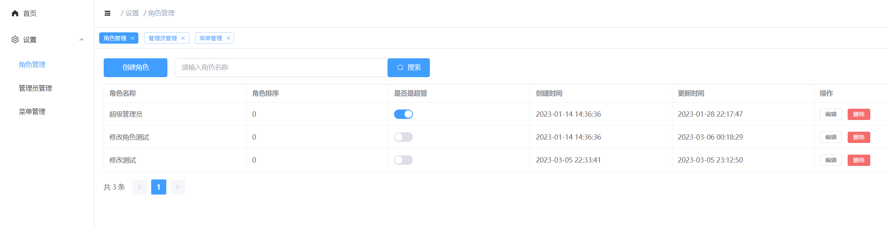
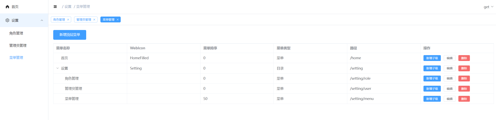

# up-admin

> 基于 Vue3、Gin 的后台管理系统

## 安装

1. clone项目

```shell
git clone https://gitee.com/up-zero/up-admin.git
```

2. 进入 `server` 目录中启动后台程序（更多说明请参考`server`中的`README.md`）

```shell
go run main.go
```

3. 进入 `frontend` 目录中启动前台程序（更多说明请参考`frontend`中的`README.md`）

```shell
npm run dev
```

## 项目介绍

+ 角色管理


+ 菜单管理

